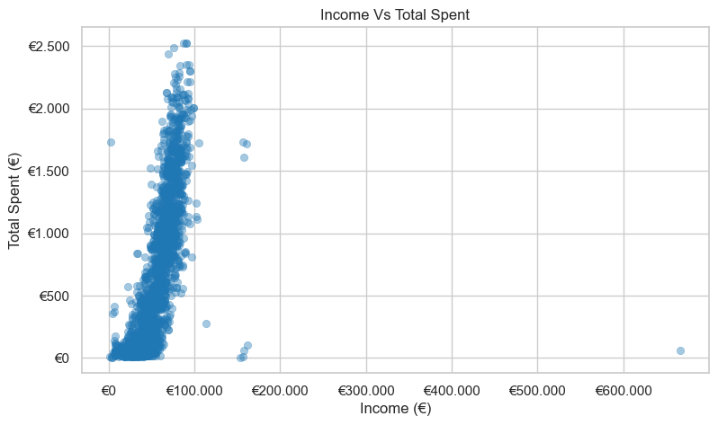
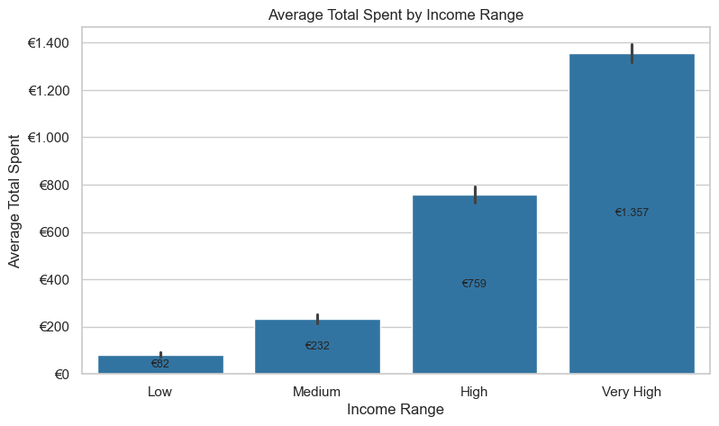
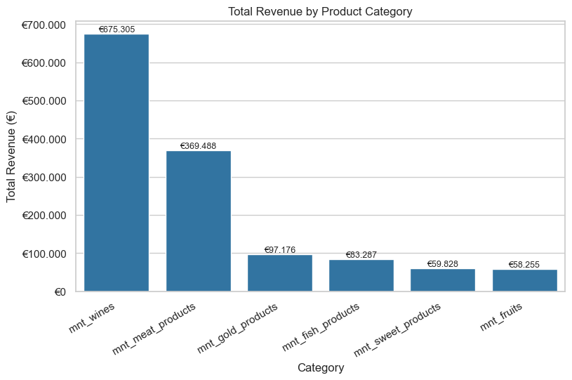
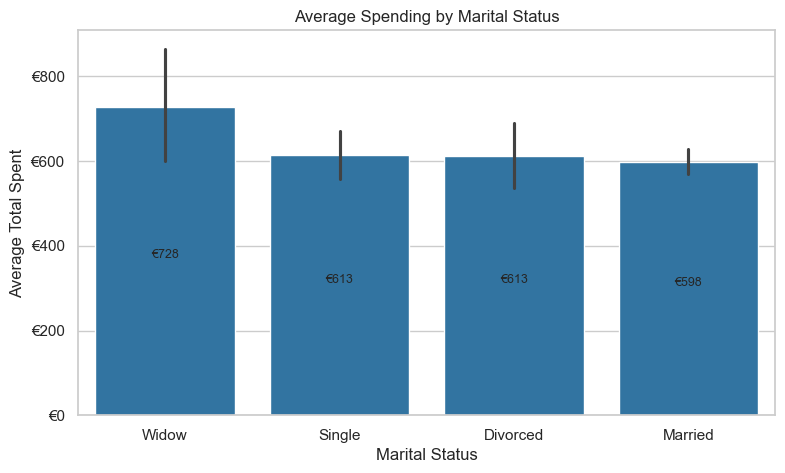
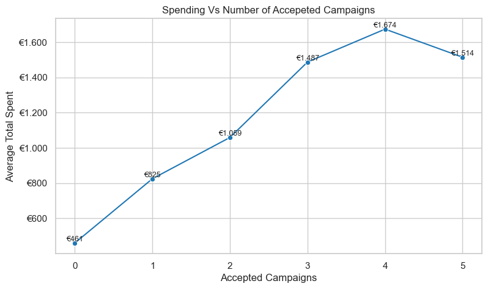
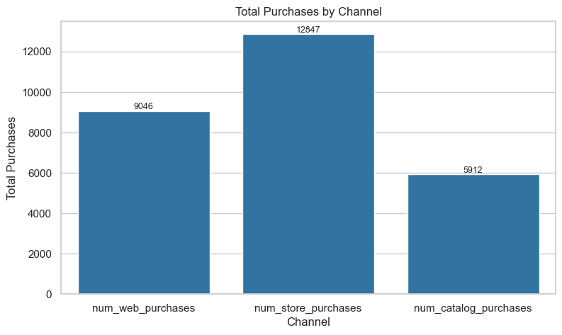

# Customer Personality Analysis


**Data Analysis Project | Python · Pandas · Matplotlib · Seaborn**

## Overview

Questo progetto analizza il comportamento d’acquisto dei clienti per identificare segmenti ad alto valore, categorie prodotto trainanti, efficacia delle campagne marketing e canali di acquisto più rilevanti.

---

## Business Questions

1. Quali clienti spendono di più?
2. Quali categorie di prodotto generano il maggior fatturato?
3. La spesa varia in base allo stato civile?
4. Le campagne marketing sono efficaci?
5. Quali canali di acquisto sono più utilizzati e redditizi?

---

## Dataset

- Fonte: [**Customer Personality Analysis** (Kaggle)](https://www.kaggle.com/datasets/imakash3011/customer-personality-analysis)
- Contiene dati demografici, spesa per categoria prodotto, canali d’acquisto e risposte alle campagne marketing.

---

## Project Structure

```
customer_personality_analysis/
├── data/
│   └── customer_personalitymarket.csv
├── images/
│   ├── dashboard_full.png
│   ├── db_schema.png
│   ├── income_vs_spending.png
│   ├── spending_by_income_range.png
│   ├── product_categories.png
│   ├── spending_by_marital_status.png
│   ├── marketing_spending.png
│   └── purchase_channels.png
├── notebook/
│   └── customer_personality_eda.ipynb
└── README.md
```

---

## Data Cleaning & Feature Engineering

Principali operazioni:
- Standardizzazione dei nomi delle colonne
- Rimozione dei valori mancanti in `income`
- Rimozione outlier non realistici sull’età
- Normalizzazione dello stato civile

Feature create:
- `age` (età del cliente)
- `total_spent` (spesa totale per cliente)
- `children` (numero di figli in casa)
- `total_purchases` (acquisti totali per canale)
- `campaign_response_total` (numero campagne accettate)

---

## Visual Analysis & Key Insights

### 1) Spesa e reddito (Domanda 1)

Relazione positiva tra `income` e `total_spent`, con presenza di clienti ad alto valore.



Segmentazione per fasce di reddito: la spesa media cresce all’aumentare del reddito.



---

### 2) Categorie prodotto (Domanda 2)

Il fatturato è dominato da poche categorie (tipicamente vino e carne).



---

### 3) Stato civile (Domanda 3)

I clienti Married generano il volume principale, mentre il gruppo Widow risulta piccolo ma con spesa media elevata.



---

### 4) Marketing (Domanda 4)

All’aumentare delle campagne accettate, aumentano spesa media e valore cliente.



---

### 5) Canali di acquisto (Domanda 5)

Store è il canale dominante per volume e valore; Web è secondo e rappresenta opportunità di crescita.



---

## Final Conclusions

- La spesa dei clienti è concentrata: una minoranza genera una quota significativa del fatturato.
- Il reddito è un forte predittore della spesa totale.
- Vino e carne sono i principali driver di ricavo.
- Married è il segmento più numeroso e rilevante per ricavi totali; Widow è piccolo ma con spesa media più alta.
- Le campagne marketing hanno risposta contenuta, ma i responder hanno reddito e spesa significativamente maggiori.
- Store domina per volume e valore; Web mostra potenziale di crescita con strategie mirate.

---

## Tools & Technologies

- Python
- Pandas
- Matplotlib
- Seaborn
- Jupyter Notebook

---

## Riproduzione

```
bash
python -m venv venv
# Windows: venv\Scripts\activate
# macOS/Linux: source venv/bin/activate
pip install -r requirements.txt
jupyter notebook notebooks/netflix.ipynb
```

---

## Come eseguire il notebook

Clonare il repository.

Installare le dipendenze minimo (pandas, matplotlib, seaborn).

Aprire il notebook in Jupyter / VS Code.

Eseguire tutte le celle in ordine.


